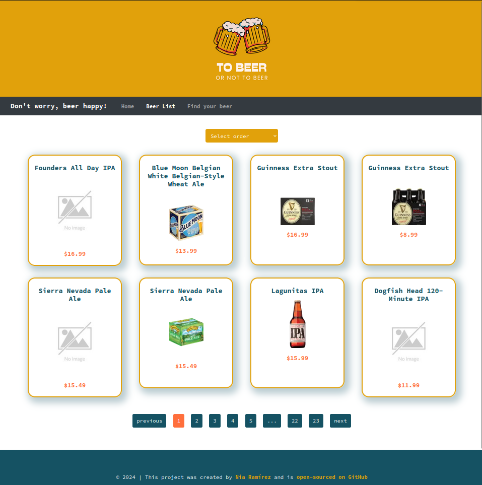
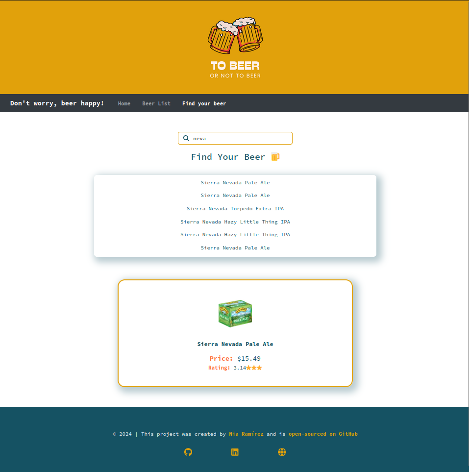

# To Beer or Not To Beer

[](https://github.com/estefaniaramirezmnt/react-beer-website/actions/workflows/node.js.yml)
[](https://app.netlify.com/sites/tobeerornottobeer/deploys)


[To Beer or Not To Beer](https://tobeerornottobeer.netlify.app/) is a web application that helps beer enthusiasts find and rate beers from around the world. This app is designed to help you explore and enjoy the vast world of beer.

## Table of Contents

- [To Beer or Not To Beer](#to-beer-or-not-to-beer)
  - [Table of Contents](#table-of-contents)
  - [Features](#features)
  - [Technologies Used](#technologies-used)
  - [Installation](#installation)
  - [Usage](#usage)
  - [Contributing](#contributing)
  - [License](#license)
  - [Visuals](#visuals)
  - [**Thank you for visiting!**](#thank-you-for-visiting)

## Features

- **Beer List**: Browse a list of beers from around the world where you can sort them by name or price.
- **Search Beers**: Find beers by the name. Once you find a beer, you can click on it to view more details.
- **User Ratings**: Rate and review beers you've tried.
- **Responsive Design**: The app is designed to work on all devices, including mobile, tablet, and desktop.

## Technologies Used

- **Frontend**: React, CSS, HTML
- **API**: [Sample API](https://sampleapis.com/api-list/beers)
- **Hosting**: Netlify

## Installation

To run this project locally, follow these steps:

1. Clone the repository:
   ```bash
   git clone git@github.com:estefaniaramirezmnt/react-beer-website.git
    ```
2. Install the dependencies:
   ```bash
   npm install
   ```
3. Start the development server:
   ```bash
    npm start
    ```

## Usage 
1. Open your browser and go to `http://localhost:3000/` to view the app.
2. Browse the list of beers and see all the beers available.
3. Search for a beer by the name and click to view detailed information and user ratings.

## Contributing

We welcome contributions to this project! If you have suggestions or bug reports, please open an issue on our GitHub repository. If you'd like to contribute code, please fork the repository and submit a pull request.

## License

This project is licensed under the terms of the Apache License 2.0.

## Visuals






## **Thank you for visiting!**